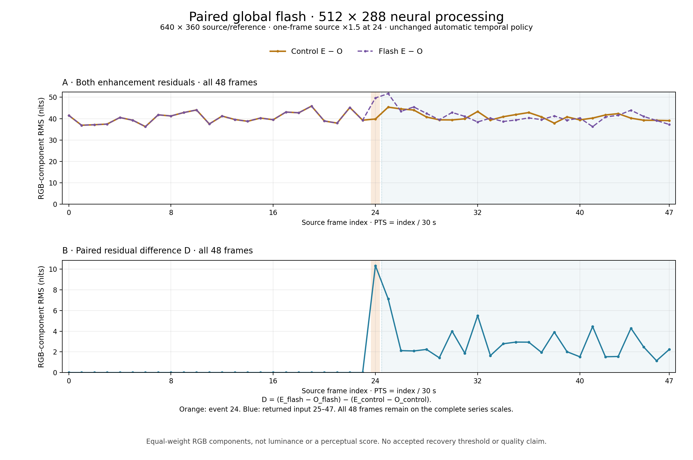
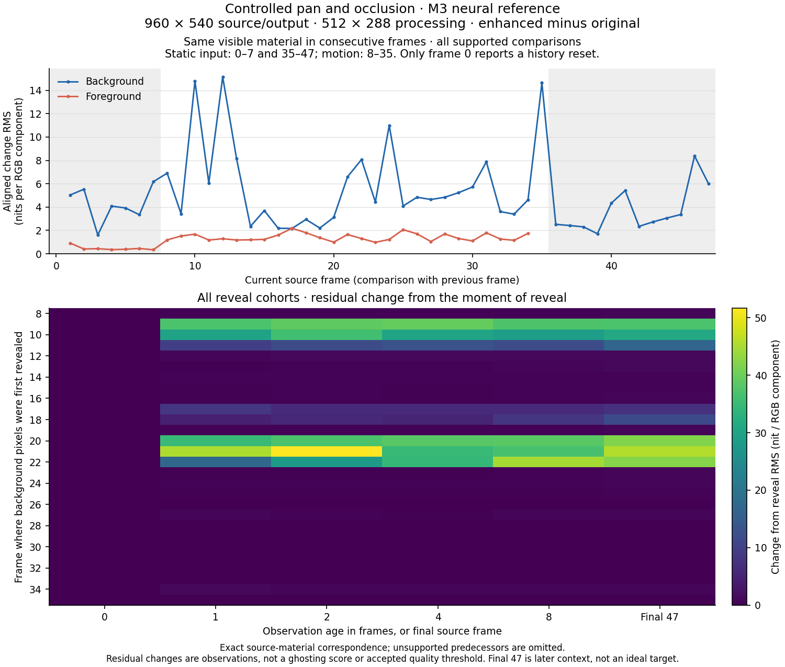

# Consecutive neural reference capture

The diagnostic `hdr-benchmark --reference-sequence` mode processes consecutive source frames through one persistent `NativeHDRProcessor`. Each result supplies original, neural proxy, identity reconstruction and enhanced views from the same source frame and exact timestamp. This mode writes full Float32 references before output packing or display mapping. It does not measure playback throughput or establish temporal quality.

## Input contract

Provide a schema 1 JSON manifest alongside raw input files:

```json
{
  "schemaVersion": 1,
  "width": 320,
  "height": 134,
  "layout": "RGB float32 little-endian top-to-bottom",
  "primaries": "BT.2020",
  "transfer": "linear",
  "units": "cd/m2",
  "provenance": {
    "description": "Source hashes, publisher interpretation, explicit transforms and assumptions"
  },
  "frames": [
    {
      "sourceFrameIndex": 10000,
      "path": "frame-10000.rgb32f",
      "sha256": "64 hexadecimal digits",
      "pts": { "value": 0, "timescale": 2997 },
      "duration": { "value": 125, "timescale": 2997 }
    }
  ]
}
```

Each payload contains tightly packed RGB Float32 values with no alpha, stride padding, colour conversion or normalized-white scaling. Finite negative and greater-than-10,000-nit components remain intact. Relative paths must resolve to regular files inside the manifest directory, including after symlink resolution. Preflight checks every file's exact size, hash and finite components before allocating a model. A second check immediately before processing detects changed payloads or paths. The captured original must match the input payload byte for byte.

Source frame indices and rational PTS must increase strictly; durations must be positive. Explicit timing gaps or overlaps are preserved. The manifest must contain 1–120 frames, each at most 2,073,600 pixels. The intended natural-scene inspection contains 48–120 consecutive frames. The first supplied frame starts with cold history; no frames are silently added as preroll or removed as warmup.

`provenance` is preserved verbatim, and an exact copy and hash of the full input manifest retain any additional per-frame source fields. An image sequence's assigned derivative timeline must be distinguished from publisher-established timing. Likewise, a selected interpretation of ambiguous colour metadata remains an assumption in the capture; this tool does not certify it. Untagged video and EXR files are not decoded by this mode.

## Capture

```sh
source scripts/env.sh
swift build --product hdr-benchmark -j 2
.build/debug/hdr-benchmark --reference-sequence-validate INPUT/manifest.json
.build/debug/hdr-benchmark \
  --reference-sequence INPUT/manifest.json \
  --output artifacts/temporal-reference \
  --model models/neural-rendering/NeuralRendering.dlssmodel \
  --width 160 --height 96
```

Validation is CPU-only. The capture runs inference and must use a reserved GPU window when other measurements are active. The output directory must be new. Run from the repository root to record source revisions and file hashes; the report marks unavailable provenance instead of inventing it.

Optional settings are `--frames`, `--strength`, `--colour-strength`, `--maximum-luminance-ratio`, `--reference-white`, `--motion` and `--maximum-output-bytes`. Defaults are all supplied frames, strength 1, colour strength 1, ratio 2, white 203 nits, automatic optical flow and a 2 GiB output allowance. An explicit `--maximum-output-bytes` may raise that allowance to at most 6 GiB, including the 4 MiB metadata reserve. The CPU-only `--reference-sequence-validate` command accepts the same option. Motion also accepts `videotoolbox`, `vision` and `zero`; `zero` disables optical flow and must not be represented as an automatic-flow result. Processing dimensions default to 160 × 96 and may contain at most 512 × 288 pixels. Temporal mode, float16 model precision and scene-cut threshold 0.3 remain fixed.

Four Float32 RGB views require `frames × width × height × 48` bytes. Preflight reserves another 4 MiB for bounded manifests and frame metadata, within the selected allowance (2 GiB by default, at most 6 GiB by explicit opt-in). The capture processes one frame at a time and writes one view at a time; the model and its temporal state persist. It configures MLX's soft free-cache policy to 256 MiB. Whole-buffer releases can exceed that value until a later allocation reclaims cached buffers; it is neither an instantaneous cache ceiling nor a hard process-memory limit.

Each frame directory is staged before atomic publication. The run manifest records only published frames and remains `complete: false` until all selected frames finish and the input manifest/model hashes are rechecked. A failed or interrupted run is preserved as incomplete; it is not resumable because reconstructing temporal state would require replay. Use a new output directory for a repeat.

The report records source identity, exact PTS/duration, frame index, generation, settings, model files, implementation/binary hashes, Metal device, completed stage wall times, allocation snapshots and full-view hashes/statistics. All four views are generated from one result, without a second neural submission. `historyReset` combines input/geometry discontinuities and detected cuts. `knownInputDiscontinuities` identifies cold start, skipped source indices and PTS gaps exceeding the processor's existing threshold; it does not claim a specific internal reset reason. The public result does not expose cut scores or the selected automatic optical-flow backend.

New captures record `modelInputRange: bounded-sRGB-after-resample`: native HDR processing bounds the resized model input before feature generation and postprocessing. The exported proxy remains the source-size encoded view. Its range alone does not prove the range of a resized model input. Earlier manifests retain their original runtime provenance and are not relabeled with the new policy.

## CPU review artifacts

```sh
uv run --frozen python scripts/review-reference-sequence.py \
  artifacts/temporal-reference/manifest.json \
  --output artifacts/temporal-reference-review
open artifacts/temporal-reference-review/index.html
```

The reviewer accepts `--maximum-input-bytes` to opt into at most 6 GiB of raw input; its default remains 2 GiB. Generated review files retain a separate 2 GiB limit. A capture manifest cannot raise either caller limit.

The review script first requires a complete capture and validates its input-manifest copy, paired exact timing, original identity and every payload. It creates one four-panel PNG per frame, `review.json`, and a local frame-step/play viewer. Publication occurs only after all outputs finish. The review directory must be new; raw captures are never rewritten.

Original, identity and enhanced previews share a fixed mapping: clamp negative source components for review, divide by the captured reference white, multiply by the recorded BT.2020-to-BT.709 matrix, roll luminance above 0.75 toward 1 with the existing codec's exponential knee, clip the resulting gamut to 0–1, encode sRGB and round to 8-bit PNG with an embedded sRGB ICC profile. Clipping and quantization statistics are recorded separately. No per-frame exposure or histogram adaptation occurs. The proxy is already bounded, encoded sRGB; it receives only PNG quantization, avoiding a second transfer function.

The full raw references preserve values lost in these SDR inspection images. Numeric identity-versus-original and enhanced residual errors remain in nits. Consecutive residual differences compare fixed pixel coordinates and can be dominated by motion or cuts; they are observations, not quality scores. The viewer retains exact rational labels, pairs labels with completed image loads and reports frames skipped by its browser scheduler. Browser playback, mapped previews and allocator samples do not establish physical HDR accuracy, presentation cadence or A/V synchronization.

## CPU checks

```sh
.build/debug/hdr-benchmark --reference-sequence-self-test
uv run --frozen python scripts/review-reference-sequence.py --self-test
```

These checks cover raw-value preservation, malformed timing, corruption, length mismatch, directory/symlink escape, nonfinite data, fixed mapping, proxy transfer handling and complete/incomplete review publication. They use synthetic CPU data and do not substitute for a real neural sequence capture.

## Controlled pan and occlusion input

`scripts/prepare-occlusion-reference.py` creates a synthetic working-image sequence for testing temporal behavior where source motion and visibility are known. It generates pixels on the CPU, with no media decoder, model or display. Grain and flashes are excluded so they cannot confound the pan/occlusion case.

```sh
uv run --frozen python scripts/prepare-occlusion-reference.py \
  --output artifacts/occlusion-reference-input
.build/debug/hdr-benchmark --reference-sequence-validate \
  artifacts/occlusion-reference-input/manifest.json
```

The canonical sequence contains 48 frames at exact 30-fps timestamps. Default geometry is 960 × 540; `--scale 1` produces a smaller 160 × 90 input for CPU checks. Frames 0–7 are static. Frames 8–35 pan across a deterministic background while an opaque foreground object moves independently. The object is fully outside the viewport at frame 35; frames 36–47 hold the revealed background still. Direct linear BT.2020 Float32 values include dark gradients, coloured detail and HDR highlights in cd/m². These are defined working-image values, not a mastered HDR10/HLG source or a physical colour reference.

At the default scale, the background moves six pixels left and the foreground moves 24 pixels right per moving frame. A current background pixel corresponds to the previous image at `x + 6`; a current foreground pixel corresponds at `x - 24`. Saved masks distinguish foreground/background ownership, valid previous-frame correspondence, object disocclusion and pixels entering at the viewport edge. A background pixel is newly revealed by the object only when its previous background-material coordinate was in bounds and occupied by the foreground. Subtracting foreground masks at the same screen coordinates would give a different, incorrect reveal region.

The manifest pins the generator, recipe, exact timing, RGB payloads and auxiliary masks. Its RGB frames use the existing reference input contract; masks describe the source scene and are not supplied to the neural processor as optical flow or history hints. The first frame has no previous-frame correspondence. Static RGB/ownership can remain identical while transition-derived masks change, including between frames 35 and 36.

Use a new output directory. Incomplete preparation is retained on failure; the final input manifest is published only after the payload checks complete. The default RGB input occupies 298,598,400 bytes, plus masks and metadata. A later four-view capture requires another 1,194,393,600 bytes plus metadata and fits the existing default capture allowance. Use the normal reference capture/review commands above, keeping their model/runtime provenance.

The [M3 input validation](evidence/m3-occlusion-reference-input.json) accepted all 48 frames through the existing CPU preflight. An independent audit checked 240 masks and 72,014,184 corresponding Float32 components with no differences, including 19 exact static comparisons. A deliberately incorrect same-screen reveal mask was rejected with 2,088 missed pixels. Two small-scale generations reproduced their complete manifests exactly in the same pinned runtime; existing output and dangling-symlink controls preserved the prior evidence. The raw input, audit source and reports are retained locally at the paths and hashes recorded in the evidence. That report covers input preparation. The subsequent neural capture is described below.

Preparation and exact source correspondence do not establish neural motion estimation, absence of ghosting, accepted temporal quality or native playback. Those require a subsequent capture and review. The natural animation and live-action references below retain their separate content and provenance.

## Paired global-flash input

`scripts/generate-flash-reference.py` prepares two 48-frame inputs at exact 30 fps: a static control and a matching single-frame global flash. Both reuse frame 0 of the pinned occlusion scene, including its coloured detail, dark gradients and HDR highlights. Supported scales are 1, 2 and 4 to preserve exact dyadic arithmetic. Default `--scale 4` produces 640 × 360; `--scale 1` provides 160 × 90 CPU controls. The scene and camera stay still throughout both arms.

```sh
uv run --frozen python scripts/generate-flash-reference.py \
  --output artifacts/global-flash-input
.build/debug/hdr-benchmark --reference-sequence-validate \
  artifacts/global-flash-input/control/manifest.json
.build/debug/hdr-benchmark --reference-sequence-validate \
  artifacts/global-flash-input/flash/manifest.json
```

Only frame 24 in the flash arm differs: every source RGB component is multiplied by exactly 1.5 in Float32, without clipping. Frame 25 returns to the same original bytes as the control. All other paired frames have identical source bytes, ordinals, PTS and durations. Each arm retains 48 uniquely named RGB files and its own source/runtime/recipe pins. Separate `event-groundtruth.json` files identify the input event; they are not reset or discontinuity instructions. A complete `pair.json` is published only after both persisted inputs pass checks. Existing directories and dangling symlinks are refused; failed preparation remains available for inspection.

At the default size, paired RGB inputs occupy 265,420,800 bytes. Two later four-view captures require 1,061,683,200 bytes more. Including a 2 GiB free-space reserve and 12 MiB metadata allowance across preparation and both captures requires 3,487,170,560 free bytes before starting the whole sequence. Preparation itself checks only its input payload and 4 MiB metadata requirement; a capture runner must enforce its own remaining-space and execution limits.

For a matched neural observation, use a separate fresh persistent processor per arm and supply all 48 frames with the same pinned model/runtime and 512 × 288 processing, Float16 precision, strength/colour strength 1, ratio 2, white 203 nits and automatic motion. Keep normal noise/history evolution and automatic reset decisions. Compare outputs at the same frame ordinal in the control and flash captures, retaining both reset inventories and all pre-event, event and returned-input frames. Comparing a post-flash output only with a different earlier noise/history position would confound the experiment. This fixture supplies the explicit flash corpus case; it does not establish neural recovery, an ideal enhanced target, perceived flicker, a defect or source-rate performance.

### Matched flash analysis

```sh
uv run --frozen python scripts/analyze-flash-reference.py \
  --input-pair artifacts/global-flash-input/pair.json \
  --control artifacts/global-flash-control-capture/manifest.json \
  --flash artifacts/global-flash-flash-capture/manifest.json \
  --output artifacts/global-flash-analysis
```

The analysis first requires both complete 48-frame captures, their original input pair, exact source/timing/model/runtime pairing and all four finite, hashed views per frame. All four views at each pre-flash ordinal 0–23 must match between arms before post-flash interpretation is admitted. A failure is retained without selecting only matching frames. Automatic history-reset flags are observations, not prescribed results.

For each RGB component at the same pixel and ordinal, define control residual `R_control = E_control − O_control`, flash residual `R_flash = E_flash − O_flash`, and paired residual difference `D = R_flash − R_control`. Each arm's original is subtracted before comparing enhancement, including frame 24 where the flash original is deliberately brighter. Once original pixels return to their matched values at frame 25, `D` also equals the difference between enhanced outputs. The control retains its own natural temporal variation.

Report whole-frame signed mean, mean absolute, RMS and maximum absolute component values in nits for all 48 ordinals. Summaries retain the pre-event interval 0–23, event frame 24 and returned-input interval 25–47 separately. Component RMS weights red, green and blue equally; it is not luminance or a perceptual score. Any recovery zoom supplements the full series without removing the event. A later output or the control is an empirical comparison, not an ideal enhanced target or an accepted recovery threshold.

### M3 paired flash observation

The [paired capture evidence](evidence/m3-global-flash.json) retains both complete 48-frame runs at 640 × 360 source/reference resolution and 512 × 288 neural processing. All 384 raw views were finite and matched their recorded hashes; all 96 original views matched the prepared source bytes. The 96 pre-event view pairs were byte-identical. Both runs reported a history reset only at frame 0, with no reset at the flash. Maximum identity-minus-original component errors were 0.000003814697265625 nit for control and 0.0000152587890625 nit for flash.

The [complete scalar CSV](evidence/m3-global-flash.csv) preserves 144 residual records across all 48 ordinals. Independent saved-pixel recomputation matched every per-frame metric and all pooled mean/RMS values exactly. Three CPU controls separately exercise known paired residuals and rejection of resealed pre-event or source-event mismatches; their fabricated captures are not model evidence.

| Interval | Control E−O RMS (nit) | Flash E−O RMS (nit) | Paired D RMS (nit) |
| --- | ---: | ---: | ---: |
| Pre-event 0–23 | 40.452169 | 40.452169 | 0 |
| Event 24 | 39.838066 | 49.686404 | 10.331803 |
| Returned input 25–47 | 41.034586 | 41.148813 | 3.128464 |

These interval values pool squared component residuals before taking the square root. At frame 24, maximum absolute paired D was 722.585449 nit. The returned-input series was nonmonotonic: its largest frame RMS was 7.118499 nit at frame 25, and frame 47 was 2.241336 nit. This records a response relative to the matched evolving control; it does not isolate individual noise/history contributions or establish a perceptual, defect, recovery or throughput threshold.



The [standalone PDF](evidence/m3-global-flash.pdf) contains the same complete series. The figure uses equal-weight RGB component RMS throughout, with no frame filtering or luminance conversion.

## Synthetic grain-like contrast input

`scripts/generate-grain-reference.py` prepares one 48-frame input at exact 30 fps using the same static canonical scene as the flash control. Frames 0–23 and 36–47 retain the clean scene bytes. Frames 24–35 apply a new deterministic sign field at each ordinal: every 2 × 2 source-pixel cell selects a nominal achromatic multiplier of `31/32` or `33/32`. The source operation is Float32 multiplication without clipping. Supported scales are 1, 2 and 4; default scale 4 is 640 × 360. This is a synthetic grain-like contrast stimulus, not a natural film-grain model.

```sh
uv run --frozen python scripts/generate-grain-reference.py \
  --output artifacts/grain-input
.build/debug/hdr-benchmark --reference-sequence-validate \
  artifacts/grain-input/manifest.json
```

For each active ordinal, the field concatenates SHA256 digests of the ASCII seed `hdr-grain-reference-v1`, followed by the ordinal and block counter as UInt32 little-endian values. Digest bytes are read least-significant bit first into row-major cells; bits 0 and 1 select signs −1 and +1. The saved source-sized Int8 fields, source RGB files, event timing and generator/environment pins make that construction inspectable. Signs are not rebalanced: each realized mean is recorded, with no exact zero-mean claim. The two factors are exactly representable, while any Float32 product rounding is measured and retained. Event metadata does not force a history reset or input discontinuity.

At 640 × 360 the input contains 132,710,400 RGB bytes and 2,764,800 sign-field bytes, plus metadata. A four-view 48-frame capture adds 530,841,600 bytes. The generator requires a fresh output path, including rejection of dangling symlinks, and checks space for its payloads plus 4 MiB metadata. A capture runner must separately enforce its runtime and remaining-space limits.

Compare the grain capture with the existing clean control from the paired flash fixture, using all 48 matching ordinals and a fresh persistent processor for each arm. Require the same source geometry, model/runtime and settings: 512 × 288 neural processing, Float16, strength/colour strength 1, ratio 2, white 203 nits, temporal processing and automatic motion. Keep normal noise/history progression and automatic reset decisions. Before interpretation, all four view pairs at ordinals 0–23 must be byte-identical; a failure rejects the comparison rather than shortening the prefix.

### Grain input, output and residual analysis

Run the analysis after both complete captures are available:

```sh
uv run --frozen python scripts/analyze-grain-reference.py \
  --grain-input artifacts/grain-input/manifest.json \
  --control-input artifacts/global-flash-input/control/manifest.json \
  --control artifacts/global-flash-control-capture/manifest.json \
  --grain artifacts/grain-capture/manifest.json \
  --output artifacts/grain-analysis
```

The analyzer verifies both complete captures, exact input/timing/runtime pairing, all source and four-view payload hashes, and finite components. It independently reconstructs the SHA256 sign stream, checks the saved 2 × 2 fields and Float32 source products, and verifies clean source bytes outside frames 24–35. Define the following fields at the same source pixel and ordinal, converting RGB components to Float64 before subtraction:

| Field | Definition | Observation |
| --- | --- | --- |
| C | E_control − O_control | Control enhancement residual |
| R | E_grain − O_grain | Grain-arm enhancement residual |
| G | O_grain − O_control | Actual source-input difference |
| Q | E_grain − E_control | Paired enhanced-output difference |
| D | R − C = Q − G | Paired residual difference |

Whole-frame signed mean, mean absolute, RMS and maximum absolute component values retain all 48 ordinals. Source and output differences remain separate so the deliberately added contrast is not mistaken for an enhancement residual. Once the clean input returns at frame 36, G is zero and D equals Q. No output/input gain ratio or grain-retention threshold is prescribed.

Adjacent observations retain all 47 pairs using `ΔG_i = G_i − G_(i−1)`, and likewise ΔQ and ΔD. These are differences of component arrays before aggregation, not differences of frame RMS values. Summaries keep prefix pairs 1–23, onset pair 23→24, active interior pairs 25–35, removal pair 35→36 and returned-input interior pairs 37–47 separate. Pooled RMS comes from total squared components and component counts, not mean frame RMS. A successful analysis produces a 381-row CSV with 240 frame records and 141 adjacent records.

All metrics weight RGB components equally; they are not luminance or perceptual scores. Matched-control differences retain the control's natural temporal variation and do not independently attribute results to noise, history, estimated flow or reconstruction. Public reset/model/motion-request fields remain observations, without implying a selected flow backend, reset cause, visual acceptance or source-rate qualification.

The 640 × 360 source preparation has passed the independent saved-input audit and the benchmark's CPU reference-sequence preflight. Three analyzer CPU controls also pass, using fabricated captures to check known input/output/residual fields, pooled and adjacent metrics, and rejection of resealed prefix or deterministic-field mismatches. They can be reproduced with `uv run --frozen python scripts/test_grain_reference_analysis.py`; they do not execute a model.

The actual grain capture and result analysis remain pending AC power. The retained runner report records an AC-policy refusal before launch, zero model processes and unchanged frozen inputs/runtime pins. No grain model output, result figure or paired-result acceptance is claimed. Preparation and refusal records are retained under `artifacts/grain-reference-1/` as `input-audit-1.json`, `preflight-1.json`, `grain-process-1.json` and `prelaunch-refusal-followup-2.json`.

## Motion-aligned occlusion analysis

The controlled source has exact integer motion. After capturing its complete 48 frames, compare neural residuals at the corresponding material coordinates:

```sh
uv run --frozen python scripts/analyze-occlusion-reference.py \
  --input artifacts/occlusion-reference-input/manifest.json \
  --capture artifacts/occlusion-reference-capture/manifest.json \
  --output artifacts/occlusion-reference-analysis
```

The analysis requires the original prepared directory because its mask sidecars are referenced by the capture's input-manifest copy but are not copied into the capture. It checks complete four-view pairing, input identity, timing, saved masks and exact original-pixel correspondence. Proxy pixels are encoded sRGB and do not enter the nit-domain residual calculations.

For background and foreground, it measures the change in enhanced-minus-original and identity-minus-original residuals at the same visible surface in adjacent frames. Pixels must be inside both viewports and visible as the same surface in both images. Newly revealed and entering-viewport pixels have no visible predecessor; their temporal measurements are unavailable. Empty regions are also unavailable, rather than zero error.

Reveal cohorts follow fixed background world coordinates at ages 0, 1, 2, 4 and 8, and at final frame 47 where still visible. These compare each later residual with its value when the pixel was revealed. Final-frame measurements describe later context; they do not supply an ideal enhanced target. Static intervals and public history-reset flags remain in the results.

The report and CSV contain signed mean, mean absolute, RMS and maximum absolute RGB-component residuals in nits. These describe changes in enhancement; intended enhancement can also produce nonzero residuals. They do not classify ghosting, establish perceived flicker or impose an accepted quality threshold. Use the raw views and fixed-mapping visual review alongside these measurements.

## M3 controlled occlusion observation

The [48-frame neural capture and analysis](evidence/m3-occlusion-temporal.json) uses the canonical 960 × 540 input with 512 × 288 processing, automatic motion requested, strength and colour strength 1, ratio 2 and reference white 203 nits. All 192 views pass complete-capture integrity and finite-value checks; all 48 originals match the inputs exactly. Identity reconstruction differs by at most 0.000003815 nit per component. Only cold-start frame 0 reports a history reset.

Residual variation remains after matching the same visible source material. The largest background temporal RMS is 15.1426 nits at frames 11→12; the largest background component change is 964.342 nits at 12→13. Foreground temporal RMS peaks at 2.18575 nits at 16→17. During the final static interval, frames 45→46 have identical original pixels yet an 8.38175-nit RMS change in enhancement residual. These are equal-weight RGB-component measurements, not luminance or perceived-flicker scores.

The 10,440 background pixels revealed at frame 21 show a 51.6538-nit RMS residual change two frames later, while their original pixels remain bit-identical. The later frame is an empirical context comparison; it does not define ideal enhancement or isolate a cause. All 384 regional/residual rows and 168 reveal-cohort observations are retained, including cold history, static intervals and empty regions.



[Regional CSV](evidence/m3-occlusion-temporal.csv), [cohort CSV](evidence/m3-occlusion-cohorts.csv), [standalone PDF](evidence/m3-occlusion-temporal.pdf). Five CPU tests use explicitly fabricated captures: material-attached residuals yield exact zero aligned change despite nonzero fixed-screen variation; unit frame drift yields exact unit aligned change and cohort changes equal to age. Resealed mask corruption, exact-time mismatches and existing-output controls also pass. These tests are included in CI.

The capture process exits successfully in 77.192 seconds, with peak sampled RSS 639,041,536 bytes and at least 6,602,280,960 free disk bytes; both power readings show AC. All 311 frozen input/runtime/source pins remain unchanged. The original wrapper's final model check reports failure because it compared absolute and relative directory paths literally. That failed report is preserved. A separate audit verifies the paths resolve to the same directory, both model hashes match and the completed capture passes the remaining checks; no capture was repeated or rewritten. Process duration includes preflight, inference, readback and writes and differs from the manifest's later timing origin.

The observations identify temporal residual variation for further investigation. They do not establish its cause, acceptable temporal quality, absence of ghosting, source-rate Live, physical HDR or native playback. The paired observation above extends flash coverage; grain and natural-scene quality retain their separate requirements. Raw views and the fixed SDR review remain at `artifacts/temporal-occlusion-reference-1/capture-1` and `review-1` respectively.

## M3 natural-sequence observation

The [48-frame capture](evidence/m3-temporal-reference.json) processed Cosmos Laundromat source frames 10000–10047 at 320 × 134, using 160 × 96 neural processing and the declared 2997/125 derivative frame rate. All 48 originals matched the input Float32 bytes exactly, and every view remained finite. Identity reconstruction differed by at most 0.0009765625 nit. The process completed in 10.225 seconds, including diagnostic work; this is not a playback benchmark.

The visible cut from the dial close-up to the character shot at source frame 10002 coincided with `historyReset: true`. Resets occurred at ordinals 0 and 2. The public result does not identify cut scores or per-pixel history acceptance, so this observation alone does not establish acceptable temporal behaviour. The deliberately small processing dimensions also soften visible detail. Review files are retained at `artifacts/cosmos-reference-review-final/index.html`; raw paired data is in `artifacts/cosmos-reference-capture`.

The input retains its initial D65-assumption label, extended PQ outside its nominal domain and float BOX downsampling. A separate [publisher metadata match](open-content-reference.md#publisher-metadata-match) now identifies D65 for the source files without rewriting historical manifests. Finite negatives and values above 10,000 nits remain in the references. Calibrated colour, physical output and broad natural-scene quality remain unqualified. A later CPU-only diagnostic fix preserves rational subtraction for very large PTS values; the evidence retains the original capture hashes and separately records the final 10 Swift and 15 Python CPU checks.

The [320 × 192 follow-up](evidence/m3-temporal-reference-320x192.json) uses the same 48 source frames, exact timing and model. It completed in 11.656 seconds with unchanged binaries and inputs. A separate process started directly on source frame 10002 at the same settings: all four full RGB32F views were byte-identical to that frame in the continuous run. This verifies the observed cut's result against fresh history for this configuration; it does not establish all subsequent flow-state behaviour or other cuts. Identity reconstruction again differed from original by at most 0.0009765625 nit. The larger processing dimensions alone do not establish Live qualification. Review files are at `artifacts/cosmos-reference-review-320x192/index.html`.

## Apple natural HDR reference

The [Apple sequence observation](evidence/m3-apple-temporal-reference.json) covers source frames 1488–1543 from the pinned HDR10+ trailer in [the source catalog](evidence/apple-natural-hdr-source.json). The 56-frame window includes two cuts, faces, hand/cup movement, a liquid splash and a side-lit spoon shot. All eight inspection-prelude frames remain in the capture; the review interval is 1496–1543. First and last original file PTS are 1730489/24000 and 1785544/24000, with duration 1001/24000 for every frame. No player rebasing or forced scene resets are applied.

Prepare the input using the existing pinned source file and decoded metadata inventory. The default converter is `/opt/homebrew/opt/ffmpeg-full/bin/ffmpeg`; use `--ffmpeg PATH` for another build that provides the `zscale` filter:

```sh
uv run --frozen python scripts/test_apple_hdr_reference.py
uv run --frozen python scripts/prepare-apple-hdr-reference.py \
  --output artifacts/apple-temporal-reference-input-new
.build/debug/hdr-benchmark --reference-sequence-validate \
  artifacts/apple-temporal-reference-input-new/manifest.json
.build/debug/hdr-benchmark \
  --reference-sequence artifacts/apple-temporal-reference-input-new/manifest.json \
  --output artifacts/apple-temporal-reference-capture-new \
  --model models/neural-rendering/NeuralRendering.dlssmodel \
  --width 320 --height 192 --strength 1 --colour-strength 1 \
  --maximum-luminance-ratio 2 --reference-white 203 --motion automatic
uv run --frozen python scripts/review-reference-sequence.py \
  artifacts/apple-temporal-reference-capture-new/manifest.json \
  --output artifacts/apple-temporal-reference-review-new
```

The preparer performs software HEVC decoding and full 1920 × 1080 PQ linearization. By default it then applies a Float64-accumulated 2 × 2 linear BOX reduction to 960 × 540. `--full-resolution` instead retains decoded Float32 RGB at 1920 × 1080, with the same 56 frames, exact timing and eight-frame inspection prelude. Geometry and reduction policy are recorded explicitly in the manifest. Its explicit zscale settings use limited-range BT.2020 NCL, top-left bilinear chroma, `npl=1` and `agamma=false`; planar G,B,R output is reordered into RGB absolute nits. The reference has no white-point scaling, gamut conversion or post-linearization clamp. Actual pre-conversion `showinfo` timestamps and durations must match the pinned inventory exactly. The original compressed source and unchanged raw ffprobe JSON remain authoritative provenance: parsed per-frame metadata is a projection because ffprobe emits repeated JSON keys. HDR10+ display tone mapping is neither applied nor attached to the numerical derivative.

A full-resolution input needs 1,393,459,200 raw bytes; its four captured views need another 5,573,836,800 bytes plus metadata. Use the explicit larger allowance for both capture preflight and review. Neural processing dimensions remain independently set to 320 × 192 in this example:

```sh
uv run --frozen python scripts/prepare-apple-hdr-reference.py \
  --full-resolution --output artifacts/apple-temporal-full-input-new
.build/debug/hdr-benchmark --reference-sequence-validate \
  artifacts/apple-temporal-full-input-new/manifest.json --maximum-output-bytes 6442450944
.build/debug/hdr-benchmark \
  --reference-sequence artifacts/apple-temporal-full-input-new/manifest.json \
  --output artifacts/apple-temporal-full-capture-new \
  --model models/neural-rendering/NeuralRendering.dlssmodel \
  --width 320 --height 192 --strength 1 --colour-strength 1 \
  --maximum-luminance-ratio 2 --reference-white 203 --motion automatic \
  --maximum-output-bytes 6442450944
uv run --frozen python scripts/review-reference-sequence.py \
  artifacts/apple-temporal-full-capture-new/manifest.json \
  --output artifacts/apple-temporal-full-review-new --maximum-input-bytes 6442450944
```

Mandatory synthetic conversion controls check transfer normalization, channel order and chroma treatment against an independent analytic reference, with absolute tolerance 0.0001 nit plus relative tolerance 0.00005. An earlier stricter extended-domain check failed by 0.7875 nit at an expected 19423.49 nits; its report and source are retained. This does not establish a uniform error below 0.001 nit. The actual source window has no negative or above-10000-nit linear components; its maximum falls from 1635.3121 nits before BOX reduction to 999.1243 after it. The measured preparation also used `--conversion-audit artifacts/apple-temporal-conversion-audit/report.json`, pinning the separately verified 19-control audit and matching FFmpeg binary. That optional local report is not required for other runs. Thirteen CPU regression cases cover input/metadata/timing errors, numerical layout, output preservation and a stalled decoder terminated by the watchdog. Existing paths and dangling output symlinks are refused; failed conversion leaves an incomplete preparation report. The decoder deadline is 300 seconds.

The M3 continuous capture completed all 56 frames with unchanged inputs, model and runtime binaries. All 224 raw views are finite, every original is byte-identical to its input, and maximum identity error is 0.00006103515625 nit. Eleven small negative enhanced components remain in the raw output (minimum −0.000312234 nit). Automatic history resets occurred only at cold source frame 1488 and the two observed cuts, 1498 and 1528. Independent one-frame processes at both cuts produced byte-identical original, proxy, identity and enhanced views: all eight comparisons had zero difference. These checks establish exact cut-frame equivalence for this configuration. They do not establish all subsequent motion-history behaviour. The diagnostic process took 77.543 seconds including preflight, readback and file output; this is not playback throughput. The input requires 348,364,800 bytes and the four raw views 1,393,459,200 bytes, plus metadata and reviews.

Review files are at `artifacts/apple-temporal-reference-review-1/index.html`. Independent inspection of 13 named four-panel stills found no obvious previous-shot image or fixed tiling seam in those samples, while enhancement visibly changed face brightness and colour. Saturated title highlights clip in the fixed SDR review mapping. An exploratory wall region in the cup shot had maximum adjacent mean-luminance changes of 0.2635 nit in original and 0.9854 nit in enhanced; the corresponding residual change reached 0.9264 nit. The retained region measurements have no motion compensation or perceptual threshold. Neither aesthetic improvement nor flicker-free playback is established. The full-resolution follow-up below extends capture coverage; temporal quality, broader motion/corpus coverage, physical HDR and source-rate Live qualification remain open.

## Full-resolution Apple reference

The [full-resolution capture](evidence/m3-apple-temporal-full.json) retains the same 56 frames at 1920 × 1080, with **320 × 192 neural processing**. All reconstructed planar G,B,R hashes match the earlier decoded frames, and applying the earlier Float64 BOX reduction to every new input reproduces all 56 historical 960 × 540 inputs byte for byte. Source indices, original file PTS, durations, metadata projection and the eight-frame inspection prelude also match. The original peak of 1635.3121 nits remains in the full-resolution reference.

All 224 raw views pass hash and finite-value checks, and every captured original matches its input exactly. Maximum identity component error is 0.0001220703125 nit, at an original green component of 1635.3121 nits; aggregate component RMS error is 0.000002274 nit. The enhanced references retain 99 small negative components, with minimum −0.000408964 nit. Resets occur only at 1488, 1498 and 1528. Two separate fresh processes at the latter cuts reproduce all eight continuous views byte for byte, including enhanced output.

The complete diagnostic process takes 302.161 seconds, including preflight, inference, readback and file output. Peak sampled RSS is 577,323,008 bytes. The maximum sampled MLX free cache is 291,264,158 bytes under its soft 256 MiB policy; whole-buffer releases may exceed that policy. These observations do not measure source-rate playback. Default 2 GiB preflight and review allowances refuse this workload; both explicit 6 GiB controls pass. The reviewer still caps generated output separately at 2 GiB. Thirty Swift CPU checks, 19 CLI allowance controls, 31 reviewer checks and 13 preparation checks pass for the tooling.

All 56 four-panel PNGs are retained at `artifacts/apple-temporal-full-review-1/index.html`. Inspection of 12 named SDR stills finds no obvious previous-shot image at either cut or fixed tiling seam at the displayed overview scale. Enhanced face brightness, colour and softness differ visibly. Three independently inspected stills agree with these limited observations; neither review establishes fine-detail quality across all frames or physical HDR accuracy.

The same unaligned cup-wall rectangle, scaled to `[40, 80, 360, 720]`, retains all 30 frames. Original means agree with the historical half-resolution means within 0.0000000165 nit. Maximum adjacent mean-luminance changes are 0.2635 nit in original and 1.2491 nits in enhanced. The largest enhancement-residual change is 1.1295 nits at 1503→1504; the historical half-resolution series reaches 0.9264 nit at 1526→1527. [Scalar measurements (CSV)](evidence/m3-apple-temporal-full.csv) and [trajectory plot (PDF)](evidence/m3-apple-temporal-full.pdf) preserve both complete series. Proxy encoding is nonlinear and precedes neural resampling and motion estimation, so BOX-equivalent originals do not require equal enhanced results. Benchmark revisions also differ. This comparison isolates neither a geometry effect nor a model defect, and uses no new registration or perceptual threshold.

## Regression with bounded resized model input

The [corrected full-resolution repeat](evidence/m3-apple-temporal-bounded-input.json) processes the same 56 inputs with the native HDR [input-range correction](evidence/m3-native-hdr-model-input.json). Source/reference size remains 1920 × 1080 and neural processing remains 320 × 192. All 224 new views pass integrity and finite checks. Every original, proxy and identity view matches the previous full-resolution capture byte for byte: 168 direct comparisons pass. Maximum identity error remains 0.0001220703125 nit. All enhanced frames differ; the largest component change is 67.2242 nits. The raw enhanced output retains 28 small negative components, with minimum −0.000469545 nit. History resets remain 1488, 1498 and 1528; both fresh cut controls reproduce all eight continuous views exactly.

The fixed 30-frame wall series still varies after the range correction. Maximum adjacent E−O change increases from 1.1295 to 1.6552 nits at 1503→1504, and RMS adjacent change increases from 0.5299 to 0.6837 nit. Mean E−O falls from 0.9326 to 0.5720 nit. [Complete scalar series (CSV)](evidence/m3-apple-temporal-bounded-input.csv) and [trajectory plot (PDF)](evidence/m3-apple-temporal-bounded-input.pdf) retain both runs. Independent raw replay reproduces the largest pair exactly. This enforces the declared input contract without eliminating the measured temporal variation or establishing perceptual improvement. No new registration or quality threshold is applied.

The diagnostic process completes in 296.686 seconds. Its sampled RSS peaks briefly at 1,012,121,600 bytes, compared with 577,323,008 bytes previously, then falls to 75,726,848 bytes by 49.851 seconds. From 120 seconds onward it stays below 214 MiB. Retained MLX active values match at every frame boundary: 402,622,764 bytes first, then 402,884,904 bytes. The higher startup-region peak remains unexplained; RSS and MLX counters use different accounting and cannot identify its cause. These samples show neither a hard memory ceiling nor a demonstrated progressive leak. All raw resource samples remain in the pinned audit.

Review files are at `artifacts/apple-temporal-bounded-input-review-1/index.html`. All 56 image hashes pass; inspection of three named SDR overviews at 1498, 1504 and 1528 retains visible brightness/colour/softness changes without obvious previous-shot carryover. This still-image review does not qualify physical HDR, fine detail across all frames, or flicker-free playback.

## Larger neural processing reference

The [512 × 288 processing capture](evidence/m3-apple-temporal-512x288.json) retains the same 56 full 1920 × 1080 inputs, model and bounded-input runtime as the corrected 320 × 192 reference. All 224 new views pass raw integrity and finite checks. The 168 original/proxy/identity views match byte for byte, maximum identity error remains 0.0001220703125 nit, and both fresh cut controls reproduce all eight continuous views exactly. Enhanced values differ in every frame; the largest component difference between settings is 428.7351 nits. No negative or above-10,000-nit enhanced components occur in this capture.

The logical processing area increases 2.4 times, while padded model extent changes from 320 × 320 to 512 × 320, an area increase of 1.6 times. Exact 16:9 sampling also replaces 5:3 sampling. These geometry changes affect neural and temporal calculations; the comparison does not isolate pixel count as a cause or select an accepted quality setting.

In the same 30-frame unaligned wall region, maximum adjacent E−O change falls from 1.6552 to 0.9657 nit, and adjacent RMS falls from 0.6837 to 0.4384 nit. Mean E−O rises from 0.5720 to 0.9978 nit. [All scalar samples (CSV)](evidence/m3-apple-temporal-512x288.csv) and the [trajectory plot (PDF)](evidence/m3-apple-temporal-512x288.pdf) preserve both series. Variation remains, and these regional measurements establish neither a general temporal-quality improvement nor a perceptual pass.

The diagnostic capture takes 312.806 seconds. Sampled process RSS peaks at 842,891,264 bytes before the first observed frame publication and remains below 208 MiB after 120 seconds. Reported MLX peak active reaches 818,488,010 bytes at the second frame and stays there; retained active allocation likewise stays at 404,097,320 bytes from frame two onward. MLX peak active is higher than in the baseline despite lower sampled RSS. The runs use different sampling intervals and allocation accounting, so the observations do not establish a memory improvement or a hard ceiling. All 894 resource samples, 55 publication-progress observations and 112 per-frame records remain retained. Operational watchdogs protect the run without acting as product acceptance thresholds.

All 56 four-panel images are retained at `artifacts/apple-temporal-512x288-review-1/index.html`; independent checks verify their hashes, dimensions and embedded colour-profile presence. Raw replay reproduces both runs’ largest adjacent wall pair. Three inspected SDR overviews show the new scene at each cut and visible enhancement changes in brightness, colour and softness, without an obvious previous-shot image or fixed tiling seam at that scale. Still overviews do not qualify fine detail, flicker-free playback or physical HDR.

## Wall motion and fresh-frame controls

The [wall analysis](evidence/m3-apple-temporal-motion.json) uses the 30 retained cup-shot frames, 1498–1527, to check whether source motion explains the measured brightness variation. Translation is estimated from original luminance using two reference frames and adjacent architectural detail. Original-only edge/correspondence masks retain the same pixels throughout the shot; both primary masks cover about 83% of the historical wall region. Registration brightness parameters are never applied to measured luminance. Five synthetic/interpolation controls pass, and an independent replay verifies the masks and arithmetic. The stricter masks cover less than the declared 25% minimum and remain excluded.

At frames 1526→1527, aligned original mean luminance falls by 0.039–0.041 nit while enhanced luminance falls by 0.977–0.983 nit. The enhancement residual changes by 0.938–0.942 nit, compared with 0.926 nit in the historical unaligned region. Identity luminance in the wall region agrees with original within 0.000003815 nit after identical alignment and masking. The predefined nine ±1-pixel offsets still leave adjacent residual intervals separated by at least 0.903 nit. This sampled sensitivity is not a continuous motion bound. [Trajectory plot (PDF)](evidence/m3-apple-temporal-motion.pdf) and [scalar measurements (CSV)](evidence/m3-apple-temporal-motion.csv) retain the controls and excluded configurations.

Two independent fresh-frame runs at 1526 and 1527 use the same benchmark binary, model, source payloads and processing settings as the continuous capture. Original, proxy and identity views match byte for byte; enhanced views differ. Across the whole historical wall region, the adjacent enhancement-residual change is −1.999 nits fresh versus −0.926 nit continuous. Fresh processing changes both history and the noise index, so it isolates neither mechanism. Both processes exit cleanly and all frozen files remain unchanged.

The tested translations do not explain the extra variation. The smooth wall, uncertain local motion/parallax and absence of captured internal model output, flow and confidence prevent a sole-cause diagnosis. These measurements establish neither a reconstruction/model defect nor acceptable flicker. Broader temporal content, full-resolution quality and physical HDR inspection remain open; no runtime algorithm or perceptual threshold changes follow from this audit.

## Captured noise and history diagnostic

The [controlled-state evidence](evidence/m3-occlusion-state.json) investigates the static occlusion pair 45→46 with an opt-in diagnostic published in [MLX commit `7529fd4`](https://github.com/ScriptType/MLX-DLSS/commit/7529fd460bfc90624205a8cec4e2cc6d88a7be7a). It retains the canonical 960 × 540 source, 512 × 288 logical processing, padded 512 × 320 network extent, Float16 precision and automatic motion request. Strength and colour strength remain 1, ratio 2 and reference white 203 nits. The evidence identifies the executed source and binary hashes separately from the source publication commit.

One unchanged traversal processes all 48 frames before any intervention. The harness compares all 192 full original/proxy/identity/enhanced views byte for byte with the retained capture, including exact timing, generation and reset inventory. Only frame 0 resets history. Any mismatch stops the diagnostic before the four replays and retains the failing output. Captured private arrays from frames 45 and 46 are exported only after that baseline completes, preserving their actual dtype, shape and bytes.

The four noncommitting replays keep frame-45 colour, motion, confidence, depth and full-resolution proxy fixed. They combine the naturally reached noise indices 45 and 46 with incoming histories H44 and H45: the postprocessed histories produced by frames 44 and 45 respectively. The original combination must reproduce captured features, model heads, composed model output and enhanced HDR bytes exactly before other combinations proceed. Each replay must leave the retained temporal state unchanged. The ordinary HDR codec resolves every replay back to the full source dimensions.

For this captured static pair, the actual frame-45 and frame-46 originals, colour, motion, confidence, depth and proxy are also byte-identical; that equality is observed rather than assumed. The [complete scalar CSV](evidence/m3-occlusion-state.csv) retains the comparisons. The table reports whole-frame, equal-weight RGB-component RMS differences in nits; these are neither luminance scores nor perceptual thresholds.

| Noise index | Incoming history | RMS versus actual 45 | RMS versus actual 46 |
| --- | --- | ---: | ---: |
| 45 | H44 | 0 | 8.381745 |
| 46 | H44 | 10.750322 | 2.876358 |
| 45 | H45 | 8.770974 | 2.043750 |
| 46 | H45 | 8.381745 | 0 |

Using both next-frame values reproduces every captured frame-46 tensor and enhanced output byte exactly. Changing either value alone produces a different result. Their effects are not additive: the joint change minus the sum of the two single changes has an 11.258242-nit component RMS. This is a fixed-input intervention on one static pair, not a percentage attribution of noise/history contributions or an explanation of all earlier disocclusion variation. No noise, history, reset or playback policy is tuned, and no temporal-quality, source-rate or physical-HDR acceptance follows.

The run completes 52 model evaluations and preserves all 706 wrapper pins. The independent CPU audit verifies all 132 saved state/replay payloads at their native dtype and recomputes the scalar comparisons. For the unchanged 48-frame baseline, it verifies the harness's equality records against independently rehashed historical references; matching full baseline outputs are not duplicated. Raw tensors, model files and executable binaries remain local rather than part of the public scalar evidence.

### Reproduction requirements

Use a separate checkout of the diagnostic commit, the pinned model package, and both retained directories: `artifacts/temporal-occlusion-reference-1/input` and `capture-1`. Their manifest SHA-256 values are `08790dec58ec181e927072400d9defcffd6b974b26e51b816d9558a2cdbb6262` and `fa1747a8432fb229e7890dea060f7486b7e679909411500bca7cc73e49f8c1fa`. A newly generated or differently captured sequence does not satisfy this exact reproduction gate. The public scalar files alone are insufficient.

The diagnostic APIs and test compile only with `MLXDLSS_TEMPORAL_DIAGNOSTICS`. Build the release test bundle with the recorded dependency and Metal-library pins:

```sh
source scripts/env.sh
task_checkout="$PWD/artifacts/occlusion-state-checkout"
swift build --package-path "$task_checkout" -c release --build-tests --jobs 2 \
  -Xswiftc -DMLXDLSS_TEMPORAL_DIAGNOSTICS -Xswiftc -enable-testing
```

Select only `DLSSMediaTests.NativeHDRTemporalStateReplayTests/testCapturedOcclusionStateReplay` through `xctest -XCTest`. Supply all four explicit environment paths: `MLXDLSS_TEMPORAL_STATE_INPUT` and `MLXDLSS_TEMPORAL_STATE_CAPTURE` name the manifests, `MLXDLSS_TEMPORAL_STATE_MODEL` names the model directory, and `MLXDLSS_TEMPORAL_STATE_OUTPUT` names a new output directory. With no opt-in paths the selected test skips; incomplete opt-in is an error. The process sets a 256 MiB soft MLX cache policy before model initialization. This is not a hard memory ceiling or a parent-process cache restoration.

The retained `artifacts/occlusion-state-diagnostic-1/run-watched.py` and `wrapper-config.json`, pinned by the evidence, freeze the successful build and inputs before launching that single test. They allow only the five inherited environment keys `DEVELOPER_DIR`, `PATH`, `HOME`, `TMPDIR`, `LANG`, plus the four explicit paths. The wrapper requires external power and samples process-tree RSS/free disk each second, with a 4 GiB RSS guard, 2 GiB free-space reserve and 300/180/90-second total/first-progress/subsequent-progress deadlines. It preserves failed or interrupted output without retry. Reproduction needs a newly named output/report set and a reviewed freeze of the intended build; existing evidence is never overwritten. These watchdog limits protect the diagnostic and do not measure playback performance.
