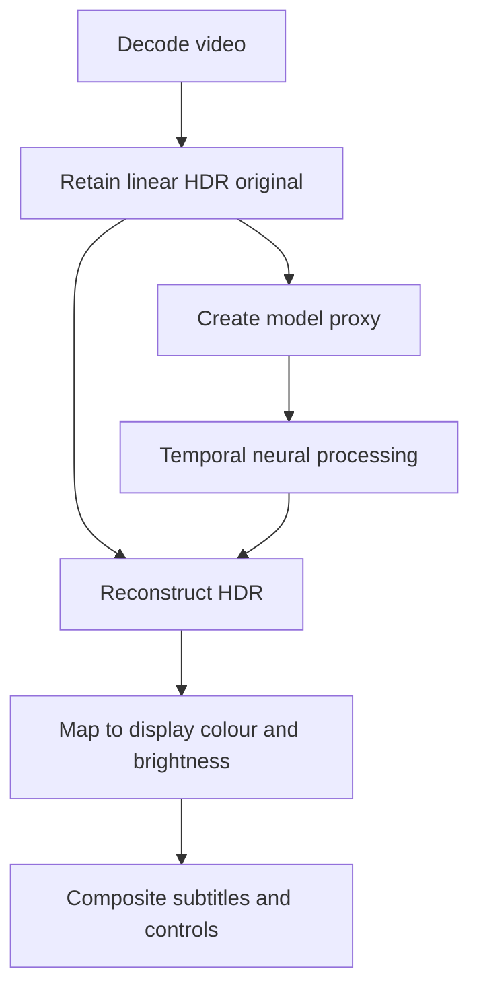

# macOS HDR video player — implementation plan

**Target:** M5 Max, 64 GB. Native HDR playback, neural enhancement, stable frame pacing and a polished macOS interface.

## Architecture

| Component | Implementation |
|---|---|
| Neural engine | Fork MLX-DLSS; Swift, MLX and custom Metal kernels |
| Video buffers | VideoToolbox/CoreVideo surfaces with explicit GPU ownership |
| Working image | Linear BT.2020 with defined luminance units; floating-point intermediates |
| Model input | Separate sRGB proxy; retain the original HDR image for reconstruction |
| Player core | mpv/libplacebo as the initial candidate; compare against Erika before final integration |
| Interface | Native macOS window and HDR video surface; Tailwind controls in WKWebView |
| Cache | Bounded RAM queues and persistent HDR segments |

## 1. Native HDR frame pipeline

Fork MLX-DLSS, pin dependencies and model weights, and add a small native playback harness.

**Changes**

- Import NV12/P010 decoder planes through CoreVideo/Metal.
- Apply range expansion, chroma reconstruction, transfer-function decoding and primary conversion on the GPU.
- Carry timestamps, crop, rotation, pixel aspect and colour metadata with each frame.
- Retain the original HDR image in a floating-point representation.
- Add an RGBA16F output path that preserves extended-range RGB.
- Configure the native Metal layer for the selected colour space and EDR output.
- Support bypass and numeric frame captures.

| Code target | Change |
|---|---|
| [NativeVideoReader.swift][mlx-reader] | Request suitable decoder formats and retain colour metadata |
| [MLXVideoFrame.swift][mlx-frame] | Add planar import and unclipped HDR packing |
| New native harness | Present frames, expose bypass and capture intermediate buffers |

**Complete when:** HDR10 and HLG clips pass through without unintended highlight clipping, gamut loss or transfer-function changes. Test grey ramps, saturated colours and dark gradients.

## 2. HDR neural processing

Connect the existing display codec to the native frame pipeline.

**Changes**

- Encode the HDR original into the model's sRGB proxy.
- Run motion estimation and neural processing in the declared proxy domain.
- Resolve the neural result against the retained HDR original.
- Adapt luminance and colour calculations to the working primaries.
- Preserve wide-gamut information through proxy conversion and reconstruction.
- Keep the model's required SDR bounds; use separate bounds for final HDR output.
- Define reference white, effect strength, colour strength and luminance-limit behaviour.
- Apply display mapping once, after reconstruction.
- Preserve metadata needed to interpret the source; update output metadata to match transformed pixels.

| Code target | Change |
|---|---|
| [NativeMediaProcessor.swift][mlx-native] | Connect proxy, inference and HDR reconstruction |
| [NeuralRenderingDisplayCodec.swift][mlx-codec] | Define colour-space and reconstruction behaviour |
| [MLXNeuralRenderingDisplayCodec.swift][mlx-gpu-codec] | Implement matching GPU operations |
| [MLXVideoOutput.swift][mlx-output] | Separate proxy composition from final HDR output |

Add source, proxy, identity-model and enhanced views at the same timestamp.

**Complete when:** zero strength returns the retained original; enhanced output retains HDR headroom and wide gamut; colour conversion errors can be isolated from intentional neural changes.

## 3. Asynchronous frame engine

Expose the engine through a small C-compatible interface shared by the player adapters.

| Frame data | Contents |
|---|---|
| Identity | Source, stream, frame and playback generation |
| Timing | Rational presentation timestamp and duration |
| Geometry | Dimensions, crop, rotation and pixel aspect |
| Storage | Pixel format, planes, strides and retained owner |
| Colour | Primaries, transfer, matrix, range, chroma location and HDR metadata |
| GPU state | Readiness event and completion token |
| Configuration | Model version, processing dimensions and effect settings |

**Scheduling**

- Keep weights, kernels, history and buffer pools alive across frames.
- Process temporal inputs sequentially.
- Overlap independent decoding, motion estimation, inference and presentation work.
- Reuse completed output for redraws, screenshots and repeated presentation.
- Start with three in-flight frame slots; tune against latency and peak memory.
- Retain each buffer until every GPU consumer completes.
- Cancel obsolete work using playback generations.
- Reset history on seeks, source changes and input discontinuities.
- Preserve valid history when only a presentation deadline was missed.
- Drive audio and video from the playback clock.

**Complete when:** seeking cannot display stale output, redraws do not advance neural history, memory remains bounded, and GPU work does not block the interface.

## 4. M5 Max optimization

Measure completed GPU work and sustained playback. Record source, processing and display resolutions separately.

Apply optimizations in this order:

| Priority | Change | Measure |
|---|---|---|
| 1 | Generate small optical-flow inputs directly; pool flow buffers | Pass count, motion quality and GPU time |
| 2 | Share compatible GPU resources and replace avoidable waits with explicit dependencies | CPU stalls, GPU overlap and buffer lifetime |
| 3 | Tune feed-forward chunk sizes and MLX cache retention | Throughput, allocation spikes and peak memory |
| 4 | Move frequently changed HDR controls into runtime parameter buffers | Shader compilation and control responsiveness |
| 5 | Retune streamed/materialized attention and graph compilation for M5 and actual input shapes | Completed frame time and numerical differences |
| 6 | Fuse adjacent kernels and intermediate conversions | Memory traffic and output differences |
| 7 | Reduce motion-statistic readbacks | Synchronization cost and cut detection |
| 8 | Add explicit neural processing dimensions independent of output size | Temporal quality and sustainable frame rate |
| 9 | Evaluate custom Metal matrix/attention kernels | Full-frame improvement at representative shapes |

Code targets: [optical flow][mlx-flow], [motion handling][mlx-motion], [transformer execution][mlx-transformer], [streamed attention][mlx-attention], [temporal backend][mlx-backend].

Keep a reproducible reference for comparisons. Fix reference behaviour when independent checks expose an error.

Evaluate reduced precision, feature reuse, approximate attention and distillation as separate quality configurations. Check temporal stability and global-context changes alongside numerical error.

**Complete when:** each retained optimization has a repeatable performance benefit, bounded memory use and an accepted image-quality result.

## 5. Select the playback core

Build thin mpv and Erika adapters around the same frame engine. Use identical clips, weights, processing settings and output dimensions.

| Integration | Required work |
|---|---|
| mpv/libplacebo | Asynchronous hardware-frame filter; processed float-frame import; Metal/Vulkan synchronization; native gpu-next/macvk view embedding |
| Erika | Asynchronous processing before presentation; processed RGB frame support; native Metal HDR surface; presenter clock and generation integration |

For mpv, integrate through its video-output/filter machinery. Keep persistent inference outside transient render hooks. For Erika, retain native HDR presentation through the adapter.

Code targets: [mpv filters][mpv-filter], [frame queue][mpv-queue], [VideoToolbox mapper][mpv-vt], [macOS embedding][mpv-mac], [Erika renderer][erika-metal], [Erika presenter][erika-presenter].

**Compare**

- Sustained throughput and p50/p95/p99 frame times.
- Presentation deadlines, drops and duplicates.
- GPU copies, CPU readbacks and synchronization.
- Memory, power and energy per processed frame.
- A/V synchronization and seek latency.
- HDR output and temporal image quality.
- Tracks, subtitles, chapters, frame stepping and window lifecycle.

Use matched display/power settings, alternating runs and sustained playback.

**Selection rule:** retain mpv unless Erika provides a repeatable end-to-end advantage while meeting the same playback and HDR requirements. If neither adapter meets those requirements, retain the shared frame engine and build a custom FFmpeg/VideoToolbox playback core.

**Complete when:** one core is selected, its remaining integration work is listed, and the comparison includes measured results.

## 6. Playback and HDR cache

### Playback modes

| Mode | Behaviour |
|---|---|
| Live | Use a quality configuration that sustains the source frame rate |
| Adaptive | Allow explicit quality adjustments while preserving HDR output |
| Prepared | Process ahead or reuse cached HDR segments |

On seeking, display the correct original frame promptly and replace it with the enhanced frame when ready. Coalesce superseded preview requests. Apply one buffering policy to audio and video.

### Cache implementation

- Key entries by source, timestamp/range, model hash, processing dimensions, colour policy, guides, effect settings and implementation version.
- Include temporal warm-up state or deterministic preroll in segment identity.
- Write into staging and atomically publish validated segments.
- Track completed ranges and resume interrupted jobs.
- Bound disk use and evict unused segments.
- Compare original and enhanced frames at identical timestamps.
- Use float storage for reference captures; evaluate an HDR 10-bit format for the production cache.
- Configure transfer functions, primaries and output metadata explicitly in the encoder.

| Reuse source | Component |
|---|---|
| [2600th cache][win-cache] and [segment index][win-index] | Cache identity, segment tracking and atomic completion |
| [SynchronizedPlayback.cpp][win-sync] | Original/enhanced frame pairing |
| [Windows GPU bridge][peter-feeder] | In-flight resource ownership and diagnostic capture points |
| [video2dlssnr][daniil-readme] | Optional NVIDIA comparison captures and parameter experiments |

**Complete when:** long playback stays synchronized, incomplete cache entries are never presented, and cached HDR matches the selected encoding policy.

## 7. macOS application

- Embed the selected renderer in a native HDR video surface.
- Build Tailwind controls in WKWebView; keep video processing and presentation native.
- Implement keyboard shortcuts, track selection, chapters, volume and subtitle controls.
- Add accurate seeking, same-frame original/enhanced comparison and processing status.
- Keep subtitle/UI brightness independent of neural enhancement.
- Handle fullscreen, resize, focus, display changes and sleep/wake.
- Add accessibility and persistent preferences.
- Add picture-in-picture after validating its processed-frame and HDR path.

**Complete when:** common playback actions remain responsive during inference and preserve colour, timing and window behaviour.

## 8. Direct Metal libplacebo branch

Start this branch if the player comparison identifies a material Vulkan/Metal overhead or interop limitation that targeted fixes cannot resolve.

**Work**

1. Implement Metal textures, buffers, formats, resource bindings and passes.
2. Add shader compilation, evaluating a SPIR-V-to-MSL route.
3. Implement synchronization, capability reporting and pipeline caching.
4. Add CoreVideo/Metal resource import and lifetime management.
5. Integrate the backend with mpv and the native display surface.
6. Run the same colour, playback and performance tests.

Code targets: [GPU backend interface][pl-gpu], [renderer interface][pl-renderer], [resource ownership API][pl-vulkan].

**Complete when:** the backend resolves the identified limitation and passes the shared quality and playback requirements.

## Acceptance criteria

| Area | Required result |
|---|---|
| HDR | No unintended SDR clipping or gamut loss; correct PQ/HLG interpretation and display mapping |
| Bypass | Original retained at the defined buffer boundary; zero strength avoids proxy quantization |
| Timing | No progressive A/V drift; target steady-state offset within 20 ms on controlled material |
| Real-time mode | Sustains source frame rate during warmed playback without accumulating backlog |
| Seeking | No stale-generation output; correct original and enhanced timestamps |
| Memory | Bounded queues, pools and cache; no sustained allocation growth |
| Temporal quality | No unacceptable flicker, ghosting, cut contamination or tiling seams |
| Interface | Responsive controls and stable fullscreen/display transitions |

Test SDR, HDR10 and HLG; 24/30/60 fps; variable frame rate; long-GOP seeking; faces, animation, grain, dark gradients, saturated colours, pans, occlusions, flashes and cuts. Include styled subtitles, multiple audio tracks and display migration.

Validate Dolby Vision separately by profile, including metadata interpretation and reshaping order.

[mlx-reader]: https://github.com/iamwavecut/MLX-DLSS/blob/6499d59c900f5e525d800e951f0000880d85c9f9/Sources/DLSSMedia/NativeVideoReader.swift
[mlx-frame]: https://github.com/iamwavecut/MLX-DLSS/blob/6499d59c900f5e525d800e951f0000880d85c9f9/Sources/DLSSMLX/MLXVideoFrame.swift
[mlx-native]: https://github.com/iamwavecut/MLX-DLSS/blob/6499d59c900f5e525d800e951f0000880d85c9f9/Sources/DLSSMedia/NativeMediaProcessor.swift
[mlx-codec]: https://github.com/iamwavecut/MLX-DLSS/blob/6499d59c900f5e525d800e951f0000880d85c9f9/Sources/DLSSCore/NeuralRenderingDisplayCodec.swift
[mlx-gpu-codec]: https://github.com/iamwavecut/MLX-DLSS/blob/6499d59c900f5e525d800e951f0000880d85c9f9/Sources/DLSSMLX/MLXNeuralRenderingDisplayCodec.swift
[mlx-output]: https://github.com/iamwavecut/MLX-DLSS/blob/6499d59c900f5e525d800e951f0000880d85c9f9/Sources/DLSSMLX/MLXVideoOutput.swift
[mlx-flow]: https://github.com/iamwavecut/MLX-DLSS/blob/6499d59c900f5e525d800e951f0000880d85c9f9/Sources/DLSSMedia/NativeOpticalFlow.swift
[mlx-motion]: https://github.com/iamwavecut/MLX-DLSS/blob/6499d59c900f5e525d800e951f0000880d85c9f9/Sources/DLSSMLX/MLXVideoMotion.swift
[mlx-transformer]: https://github.com/iamwavecut/MLX-DLSS/blob/6499d59c900f5e525d800e951f0000880d85c9f9/Sources/DLSSMLX/NeuralRenderingTransformerOperations.swift
[mlx-attention]: https://github.com/iamwavecut/MLX-DLSS/blob/6499d59c900f5e525d800e951f0000880d85c9f9/Sources/DLSSMLX/NeuralRenderingStreamedGlobalAttention.swift
[mlx-backend]: https://github.com/iamwavecut/MLX-DLSS/blob/6499d59c900f5e525d800e951f0000880d85c9f9/Sources/DLSSMLX/MLXNeuralRenderingDeviceTemporalBackend.swift
[mpv-filter]: https://github.com/mpv-player/mpv/blob/7e4cb538a3f30d25920ad8e87ba6571540fb729f/filters/filter.h
[mpv-queue]: https://github.com/mpv-player/mpv/blob/7e4cb538a3f30d25920ad8e87ba6571540fb729f/filters/f_async_queue.h
[mpv-vt]: https://github.com/mpv-player/mpv/blob/7e4cb538a3f30d25920ad8e87ba6571540fb729f/video/out/hwdec/hwdec_vt_pl.m
[mpv-mac]: https://github.com/mpv-player/mpv/blob/7e4cb538a3f30d25920ad8e87ba6571540fb729f/video/out/mac/common.swift
[erika-metal]: https://github.com/AimesSoft/Erika/blob/c4d7af8544967185e0ed82d68e52fd2952669047/crates/erika/src/renderer/metal/apple.rs
[erika-presenter]: https://github.com/AimesSoft/Erika/blob/c4d7af8544967185e0ed82d68e52fd2952669047/crates/erika/src/presenter.rs
[win-cache]: https://github.com/2600th/dlss5-video-player/blob/e297ceb7b31c8d0641281b0b2563d77281430e1c/src/NeuralCache.cpp
[win-index]: https://github.com/2600th/dlss5-video-player/blob/e297ceb7b31c8d0641281b0b2563d77281430e1c/src/NeuralSegmentIndex.h
[win-sync]: https://github.com/2600th/dlss5-video-player/blob/e297ceb7b31c8d0641281b0b2563d77281430e1c/src/SynchronizedPlayback.cpp
[peter-feeder]: https://github.com/petercunha/dlss-media-player/blob/d1f6cf73a00735f604e39f07021f0bba44c51803/launcher-source/live-rtx-feeder/dlss5-feed.cpp
[daniil-readme]: https://github.com/DaniilSokolyuk/video2dlssnr/blob/b29afd1179dbaa0c009e365adbf0339a7424e03f/README.md
[pl-gpu]: https://github.com/haasn/libplacebo/blob/3330a515d62139259c26239014f286e233bd3a5c/src/gpu.h
[pl-renderer]: https://github.com/haasn/libplacebo/blob/3330a515d62139259c26239014f286e233bd3a5c/src/include/libplacebo/renderer.h
[pl-vulkan]: https://github.com/haasn/libplacebo/blob/3330a515d62139259c26239014f286e233bd3a5c/src/include/libplacebo/vulkan.h
